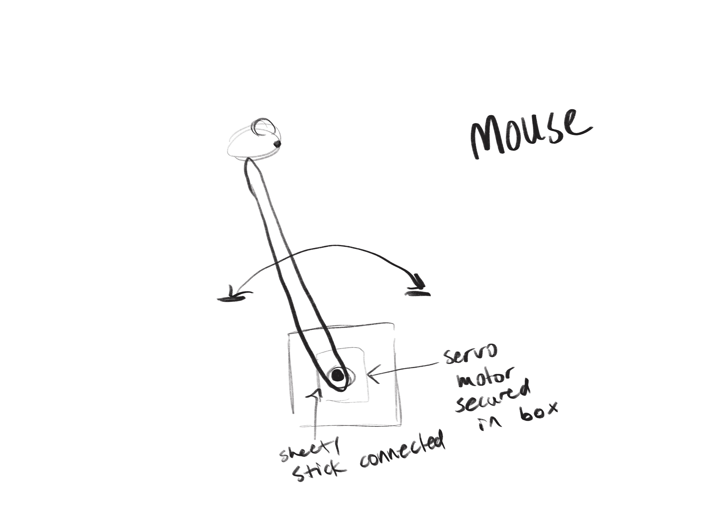
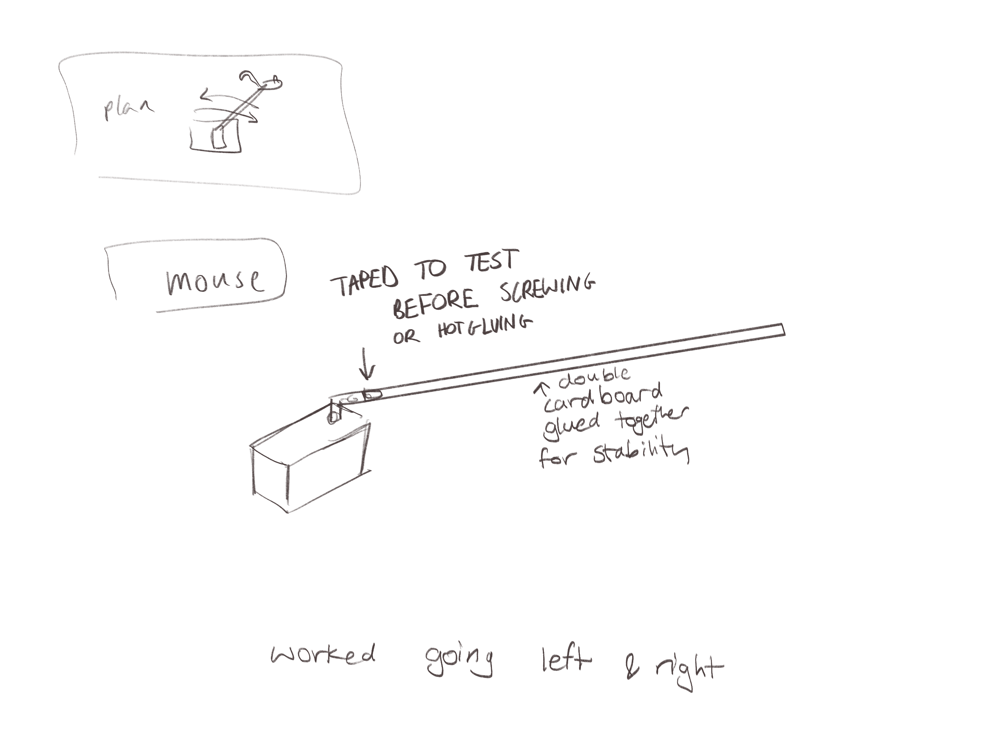
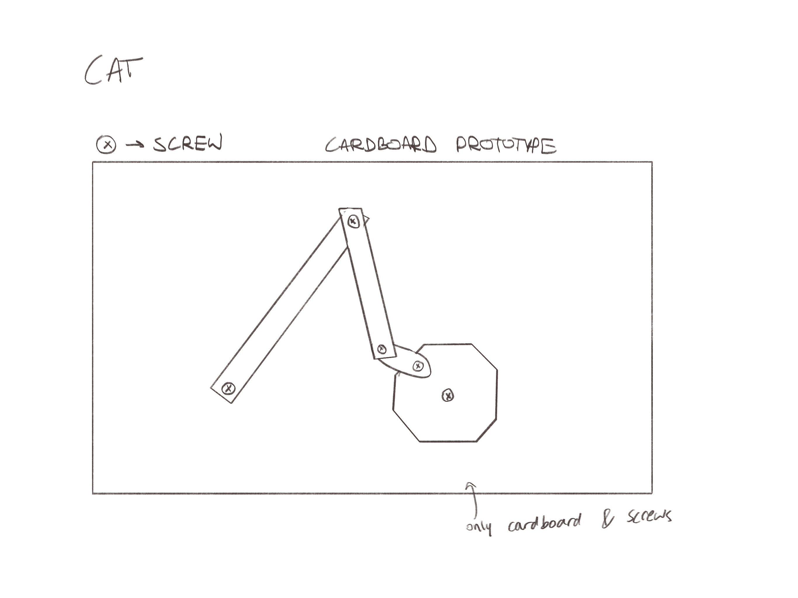

# Midterm

Prompt: "Sketch a design for some sort of mechanical contraption that uses the stepper motor, servo motor, and linkages." 

Sketch: 

Cat updated sketch:

Mouse updated sketch:

Prototypes:

Mouse:

For the mouse I taped, which we shouldn't do I just did it for the sake of seeing if it'd work before securing it in a better way, cardboard to see if it'd move the way i wanted it to and it did, it moved the cardboard stuck to it left and right. The first time the cardboard was flimsy so I put double the cardboard for structure and held the servo in my hand to see the movement. I wanted to secure it onto something solid for further testing but I didn't get the chance to.

Cat:

With the cat linkage it was a lot more complicated than the mouse, I attempted to make something similar to what Michael made as an example with cardboard but the cardboard would not turn properly, as it would get stuck sometimes. What got it to work was changing the length of the cardboard linkages as well as changing the position of how the cardboard strips are linked together by making the further out ones on the top.
